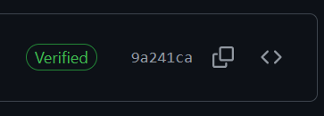
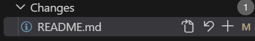

# GitHub-Reference
An entry level reference for setting up and learning how to use GitHub for software development. Contains more detail than you'll probably ever want or need. 

<!-- TODO: remove this when done with repo content-->
**Note: this repository is still a work in progress, large sections are currently incomplete, but most of the information will still be useful. I'm also still working on editing stuff down and moving sections around.**

# Table of Contents
|Section Title|Subsections|
|:---|:---|
|[1. Introduction](#1-introduction)<br><br><br><br>|[1.1: So What is GitHub?](#11-so-what-is-github)<br>[1.2: What is Git?](#12-what-is-git)<br>[1.3: Why Not Just Use GitHub Desktop?](#13-why-not-just-use-github-desktop)<br>[1.4: Visual Studio Code Setup](#14-visual-studio-code-setup)|
|[2. Getting Started With GitHub](#2-getting-started-with-github)<br><br><br><br>|[2.1: Downloading Git](#21-downloading-git)<br>[2.2: Authentication (SSH & HTTPS)](#22-authentication)<br>[2.3: Signing Keys and Signing Commits](#23-signing-keys-and-signing-commits)<br>[2.4: Git Commands in the Terminal](#24-git-commands-in-the-terminal)|
|[3. Git Basics](#3-git-basics)<br><br><br><br><br><br>|[3.1: Repositories](#31-repositories)<br>[3.2: Tracking Changes](#32-tracking-changes)<br>[3.3: Commits](#33-commits)<br>[3.4: Pushing Changes](#34-pushing-changes)<br>[3.5: Pulling Changes](#35-pulling-changes)<br>[3.6: Amending Commits](#36-amending-commits)|
|[4. Branches](#4-branches)<br><br><br><br><br><br><br>|[4.1: Switching Branches](#41-switching-branches)<br>[4.2: Creating a New Branch](#42-creating-a-new-branch)<br>[4.3: Committing a New Branch to Remote](#43-committing-a-new-branch-to-remote)<br>[4.4: Renaming a Branch](#44-renaming-a-branch)<br>[4.5: Pruning/Deleting a Branch](#45-pruningdeleting-a-branch)<br>[4.6: Merging Branches](#46-merging-branches)<br>[4.7: Merge Conflicts](#47-merge-conflicts-yay)|
|[5. Git Workflow](#5-git-workflow)<br><br>|[5.1: Pull Requests (TODO)](#51-pull-requests)<br>[5.2: Automation (TODO)](#52-automation)|
|[6. Additional Resources](#6-addtional-resources)||


# 1. Introduction
Hello and welcome to the GitHub Reference! I made this document as one easy place to get started working with GitHub for those without experience (I promise it will be *somewhat* fast). I'll also provide resources at the end if you want to learn more. 

There is a lot of depth you can go into with Git, so this document is unfortunately very long. At some point I plan to make a quickstart and a command cheatsheet, but for now, [https://git-scm.com/cheat-sheet](https://git-scm.com/cheat-sheet) is a great resource, and it covers certain things that I don't, plus it's the official one.

Just a disclaimer, I'm not an expert (I'm not a CS major, limited industry experience), so if something is confusing or flat out wrong (hopefully not), please feel free to reach out to me and let me know, and I'll do my best to fix it. 

## 1.1 So What is GitHub?

GitHub (and other sites like it) is first and foremost an online service for storing and sharing code. It facilitates collaboration on software development using version control, which is allows us to manage and track changes in software over time. 

## 1.2 What is Git?

Git is the open source  "version control" services like GitHub, GitLab, and BitBucket use. It's a collection of commands and processes used to track and log changes across multiple files, which it does via a bunch of information stored in a `.git` folder on your computer. Git stores the entire project history locally, so you don't need an internet connection to work on the project or look at code history.

Git works on any file type, but it's primarily used for source code. It works best with plain text files (like code, `.md`, and `.txt` files) because it can track changes line-by-line. It doesn't work as well with binary files (like images, videos, and compiled code) because it can't track changes within those files. Please don't use it with PowerPoint. We'll cover `.gitignore`'s in a [later section](#321-gitignores). 

### 1.2.1 Git Terminology
Here is a list of terms (TODO)

|Term|Definition|Usage|
|---|---|---|
|Repository|
|Commit| | |

## 1.3 Why Not Just Use GitHub Desktop?

Downloading GitHub Desktop and simply logging in there would definitely work for a lot of use cases, **BUT** hear me out first.

Doing Git commands from the command line interface (CLI) is often more flexible and precise than the desktop app; certain actions are very difficult/impossible, so you likely need the terminal anyway. Using the CLI helps you understand the inner workings of Git much better. The commands are also identical across operating system or service, so you can always be productive without any extra software. However, there is one gigantic caveat to this. 

**If the desktop app GUI speeds up your development, use it!** My personal preference is the CLI, so that's what this guide covers. In the end, we'll be using VSCode; most git commands have buttons there anyway. Plus, using the command line makes you feel like a wizard.

> Side note: I found GitHub Desktop kinda clunky so if you have use it and have issues, your best resource will be Google, sorry!

## 1.4 Visual Studio Code Setup
If you don't already have VSCode (Visual Studio Code), it isn't absolutely necessary but it will make your life so so much easier with Git from the CLI. Head to the [VSCode Download Page](https://code.visualstudio.com/download) and follow the install process for your machine. 

If you don't like Microsoft's telemetry practices, check out the [VSCodium project](https://vscodium.com/), an open source alternative using the same binaries that VSCode is built for (available for Windows, Mac, and Linux). Functionality is generally the same, but I, like most people, just use VSCode. 

# 2. Getting Started With GitHub

To start using GitHub, there are a couple things we need to setup to actually get things running.

## 2.1 Git Command Setup

Go to https://git-scm.com/downloads and download the latest version of Git for your operating system. Then:  
1. Run the installer
2. Follow the installation options. A few notes:
    * On the **Choosing the default editor used by Git** screen, you may want to select something (probably VSCode) other than Vim since it's a little hard to use, but we'll cover Vim basics later. 
        * This can also be changed later using the `code.editor` variable in git. 
    * On the **Adjusting the name of the initial branch in new repoisitories** screen, I chose to override the default and explicitly set the default primary branch name to the current standard of `main`. 
    * On the **Adjusting your PATH environment** make sure to select the option for "Git from the command line and also from 3rd-party software". This saves us some steps later. 
    * Keep the default behavior of 'git pull' set to "Fast-forward or merge".
3. Hit finish. If you selected an option that doesn't work and don't want to reinstall, see section 2.1.2 (TODO).  

### 2.1.1 Troubleshooting: Adding Git to PATH

[don't forget to talk about path to git bin to vscode preferences]: #

## 2.2 Authentication
You only need this section if you plan on making edits to the codebase of a repository and pushing it to main for everyone else. HTTPS is probably the easiest method, I personally prefer SSH keys for a bit more control. 

### 2.2.1 Method 1: HTTPS
Authentication via HTTPS just has you log in to your GitHub account in your browser. This can get inconvenient as you may have to log in again when pulling/pushing changes. 

### 2.2.2 Method 2: SSH Keys
Secure Shell (SSH) keys are a way to identify trusted computers without involving passwords. They are a pair (1 public and 1 private) of crytographic keys that can be used to authenticate a secure connection between your computer and GitHub.

To set up your SSH keys: 
1. Open a terminal (in your OS or in VSCode) and run `ssh-keygen -t ed25519`
    * Completely optional but potentially helpful: add a comment by adding ` -c "your-key-comment"` to the previous command. This can be useful in professional settings to identify you or its creation date; the default comment is fairly meaningless.  
    * You can change the file location or file name if you'd like. 
    * You don't necessarily need a password, but it increases security. If you add one it keeps pushing and pulling locally secure, so no one can use the key without the password if they somehow gain access to your computer.
        * Adding one will make us go through a few additional steps later. TODO 
    * ed25519 is the type of OpenSSH we're using because, by consensus, it's the best (security, algorithm complexity, compactness). Support isn't universal yet, so other options include `rsa`  (default, older, potential security risks), `ecdsa` (newish, pretty secure). 
        * Read more about best practices [here](https://www.brandonchecketts.com/archives/ssh-ed25519-key-best-practices-for-2025) and key generation [here](https://www.ssh.com/academy/ssh/keygen).
2. Either open the `.pub` file you just created or run `cat /path/to/.ssh/id_ed25519.pub` (or whatever you named your ssh key) so you can copy your public key.
3. Go to [https://github.com/settings/keys](https://github.com/settings/keys) 
4. Click the green `New SSH key` button. Title it something that makes sense to you, and make sure "Authentication Key" is selected from the dropdown. Paste the SSH public key you copied and click `Add SSH Key`.
5. If you care about verified commits, repeat step 4. with the same key but select "Signing Key" from the dropdown instead.
6. Run `ssh git@github.com` and enter yes when prompted to verify the connection with github works.

## 2.3 Signing Keys and Signing Commits
We'll cover what commits are later in Section [3.3](#33-commits), but for now, know that signing commits allows GitHub to verify that it was actually you who did the action. The image below shows what a verified commit looks like on GitHub, which you can see by going to the Commit History right under the green `<> Code ▾` button on the main repository page. 

<div style="text-align: center;">


</div>

TODO: talk about vigilant mode

To just get things up and running, we'll use the SSH key we just generated for commit signing. You can also use a GPG key instead, but it requires an additional download and some different steps. More information on GPG keys can be found [here](https://docs.github.com/en/authentication/managing-commit-signature-verification/signing-commits).


1. Run the following:
    * Note: your path will look like `~/.ssh/id_ed25519.pub` if you followed the earlier steps. 

```shell
git config --global gpg.format ssh
git config --global user.signingkey /path/to/.ssh/key.pub`
git config --global commit.gpgsign true`
```

Then, to add the signing to your github.com account (you can skip these steps if already did Step 5 of [Sec. 2.2.2](#222-method-2-ssh-keys)):

2. Go to **Settings > SSH and GPG keys > New SSH Key** and set your type to 'Signing Key'.

3. Name the key something that will make sense to you (I did the same name as the SSH key we generated earlier, just with '_signing' appended).

4. Paste in your public SSH key contents and hit the green `Add SSH Key` button.   

    * Reminder: this can be printed to terminal with `cat ~/.ssh/id_ed25519.pub` (or whatever your path/file name was).

After you make a commit, you can check whether it shows as verified on GitHub.


## 2.4 Git Commands in the Terminal

### 2.4.1 User Credentials
```shell
git config --global user.email "you@example.com"
```

````shell
git config --global user.name "Your Name" 
````

# 3. Git Basics

## 3.1 Repositories

Repositories are the way Git groups collections of code for a project. Services like github.com allow you to host that code and its history **remotely**, which means you can implement workflow, test suites, bug tracking, manage releases, etc. for yourself, whatever team you're working on, and the userbase for your project.

### 3.1.1 Local vs. Remote Repository
The way Git works means that there are two versions of the repository at any point in time:
1. **Remote:** This is the version of the repository that lives on github.com. This is the version other people can access. 
2. **Local:** This is the version of the repository which lives on your own machine/development environment, which only you can access. It contains a copy of the code on Remote, plus any edits, additions, deletions, moves, or any other changes you may have made to the codebase.

### 3.1.2 Repository Permissions


### 3.1.3 Cloning Repositories
> Note: The rest of Section 3 will use this repository in examples, but you can replace the repository name/address and references if you have another repository you are working with. 

To clone, or make a **Local** copy of, the repository onto your machine:

1. Open a Terminal or VSCode and use the `cd` (change directory) command to move to where you'd like your repository to live. 
    * Most terminals will let you autocomplete folder/file names if you type the first few letters (enough to make a selection unique) and then `tab`.
    * You can use `cd ..` to move back up a directory if you accidentally go to far down a file path.
    * You can alternatively use the **File > Open Folder** to use a GUI to navigate to the desired folder location. 
2. Run the following command to a repository you have at least read access to (this repository is public). I prefer cloning via SSH, but if you didn't set up those keys, use HTTPS:
```shell
git clone git@github.com:bassett-luke/ASEN4018_Green.git # clone via ssh
git clone https://github.com/bassett-luke/GitHub-Reference # clone via https
```

You now can use the **File > Open Folder** in VSCode to open your workspace to the newly cloned repository. If you click the Source Control icon that looks like

<div style="text-align: center;">


</div>

on the left sidebar in VSCode, you should be able to see a "Changes" toggle dropdown (should be empty at the moment).

## 3.2 Tracking Changes
Now if you go back to the Files section and open `GitHub-Reference/README.md` and make a change anywhere (doesn't matter what it is since it's on your Local repo), you'll be able to notice a couple things. 

Depending on what change you make to the text (modification, deletion, or addition), git automatically sees a change (sometimes called a diff) in the file. Git will flag that file as having changed, which you can see if you run (from anywhere in the repository):

```shell
git status
```

VSCode integrates with Git really nicely, so on the left, between the line numbers and the text editor, you should see a blue checkered bar (modification), a solid green bar (addition), or a red triangle between two lines (deletion) where you made the change. You can click on whichever shows up and a scrollable window pops up, allowing you to see the diff. You can also see the diff by running (from the project root):

```shell
git diff README.md
```

This brings up a captive window in read-only Vim, so your terminal is now locked to this output, allowing you to scroll its contents with your arrow keys. If you want to learn more about Vim, check out [Section 6.1](#61-vim), but for now you can just type `q` to exit back to the terminal prompt.

You'll also notice that a blue (for most VSCode themes) circle with a number should show up over the Source Control icon. If you click on that tab, you'll be able to see the change you made to the file, plus a couple extra icons, like shown below. 

<div style="text-align: center;">


</div>

If you hover over the options, you can open the file (assuming you didn't delete it), or revert (undo) the change. Reverting it discards **ALL** changes you have made to a file. We'll cover the plus later.

To manually revert the change, you can go ahead and run:
```shell
git restore README.md
```

### 3.2.1 .gitignore's
This is something that will generally already be set up for you in a repository, but it's helpful to know what it is. A `.gitignore` file is a simple text file that tells Git which files or directories to ignore changes for in a project. This is a useful way to avoid committing files that aren't necessary to the project, such as build files, temporary files, or sensitive information like passwordsd or API keys. 

The included `.gitignore` file in this repository is a good starting point for C++ projects, and it covers syntax as well. You can find more information about `.gitignore` files and how to create them [here](https://git-scm.com/docs/gitignore).

To show you how they work, create a new `GitHub-Reference/temp.txt`. You can move it into an existing folder or a new folder if you'd like. Save the file and see how the file is now green with a U for "Untracked" in your file explorer, sort of like the tan M before. Now open `GitHub-Reference/.gitignore` and paste `temp.txt` directly onto a new line and save your changes. 

The M should have gone away and the change should no longer show up in the Source Control tab. 

A `.gitignore` in a repository only applies to files that are untracked, so even if you added `README.md` to the `.gitignore`, git would continue to track it. If you want to stop tracking changes to a file in git without removing it from the repository, refer to [Section 5](#5-git-workflow).

## 3.3 Commits
Commits are essentially like a snapshot of the state of the repository at one point in time. If you're on the main page of this repository, you can scroll to the top and there should be a button that has a little clock and "N Commits", which you can click on to look at the history of the main branch of this repo. 

A commit can track any change you've made to the content in the repository. If you have a terminal opened in a repository, you can run the following to see all changes:

```shell
git status
```

To create a new commit **on your local** machine, you will need to run git add on any file you would like to essentially solidify your changes on. Go ahead and make a change to the `README.md` and see how the file turns tan with an M, like before, and the change shows up on the file text directly. Then run the first command below:
```shell
git add README.md

# you can add multiple files at once with
git add path/to/file1 path/to/file2 ...
# you can also add folders, allowing you to add all changes within the folder
git add pictures/
# finally, you can add all changes with
git add . # from the project root
```

You'll notice that if the file had an U in the Explorer tab, it should have changed to an A for "Added". Any changes in the workspace will get dimmer, but are still selectable, but you can no longer revert them. If you go to the Source Control tab, you'll see the same thing. You can run `git status` to see the file is now under the added section instead of modified, deleted, or untracked.

To un-add, or unstage a file from your commit, you can run (this will not undo your changes):
```shell
git restore --staged README.md
```

Now that you know how to do it from the command line, you can go to the Source Control tab and do the same thing with the plus (add) and minus symbols (unstage). 

To finally actually make your commit, run:

```shell
git commit -m "commit message describing changes"
```

By best practice, a useful commit message is descriptive enough for someone who's relatively familiar with the code to get an idea of what your commit is affecting and maybe what the goal is. It shouldn't be something like "fixed" or "update" ([nobody's perfect](https://github.com/bassett-luke/GitHub-Reference/commit/6e832153eadf2802287bd6021be706ed31e7162f), so not the end of the world if it's a little vague). 

You can also do multiple commits at once before worrying about updating Remote, so it's totally fine (and often very helpful) to make a small change and get it working, make a commit to save your work, and then keep working on your next commit.

If you need to abort your commit (you forgot a file, aren't ready to commit yet, etc.), you can either [amend your commit](#36-amending-commits) or run the command below. This just undoes the commit command, it will keep your changes staged. 
```shell
git reset --soft HEAD~1
```

Here are some other good commands to know, but use your best discretion when utilizing:
```shell
git reset HEAD~1 # removes the commit and unstages changes
git reset --hard HEAD~1 # completely deletes the last commit AND those changes, not able to be undone 
```

## 3.4 Pushing Changes
At this point, your change still only exists on your local machine. If you go to the Source Control tab and open the Graph toggle at the bottom, you will see a "Outgoing Changes" on top of the commit you just made, and there are different labels for `main` (has a little target looking icon, refers to your local) and `origin/main` (has a cloud icon, refers to remote). 

To update remote off of your changes (unless you somehow have access to the `GitHub-Reference` repository, pushing will return an error), run:
```shell
git push # yep its that simple
```

## 3.5 Pulling Changes
Up until this point, you have only been working in a vacuum, your changes don't affect anyone else, no one else would be working on the same files as you. 

However, since multiple people can have their own Local Repository (which they can make changes to and then update Remote from), it's possible your Local Repository gets "out of date" with Remote. 

To update your local repository to whatever is on remote, you will (not yet) run:
```shell
git pull
```

This command is actually two commands stapled together for convenience, being:
```shell
git fetch # downloads changes from remote to your local machine but **DOESN'T** update your files
git merge # updates your files, will cover in more detail
```
Since Git works by keeping track of changes to files and not the direct contents of the files, you should be able to just Git pull, and as long as your changes don't overwrite someone else's changes, Git will be happy and add your changes on top of the new ones. 

However, you can run into situations where you hit a merge conflict, which we will cover in a [later section](#47-merge-conflicts-yay); they can be really not fun to deal with. So if you're in a situation where merge conflicts could happen, be careful. 

You can go ahead and try `git pull` now (it won't do anything on this repository unless I made a change since you cloned it).

Pulling changes from Remote gets really important once we start working with branches in [Section 4](#4-branches).

## 3.6 Amending Commits
We haven't covered branches yet (next section), but avoid amending commits on the main branch of a repository. If others are collaborating on your branch, avoid amends once they've been pushed unless absolutely necessary, and let your team know if you are making an amend. 

If you ever make a commit and later want to change the commit message, you can run: `git commit --amend -m "new message"`

If you want to add files or additional changes without changing the message, you can run: `git add path/to/file` and then `git commit --amend --no-edit`

If you need to change both or change commit information (allows you to coauthor, or change the commit time if you for some reason need to), run:
```shell
git commit --amend
```

If you have already pushed your changes to remote, run: `git push --force-with-lease`. 

* The standard command is `git push --force`, which can overwrite others' work, so **USE WITH CAUTION**. 

# 4. Branches

Branches are one of the most useful features of Git. They are what allows multiple people to work on the same codebase without interfering with each other's work. Each branch has its own history of changes, which can all be merged when development is complete. 

Everthing starts on the `main` branch (also called the `master` or `default` branch in some repositories). The `main` branch should always contain the most up-to-date and stable (i.e. working) version of the code.

To oversimplify branches, the idea is that you can create a new branch, mess with the code however you like, reach a finished state that works, test it via compiling or uploading, and then "merge" your change back into main. 

<div style="text-align: center;">


</div>

However, since each branch has its own history, you can run into issues when someone else makes changes to either the main branch or code you were also working on. Additionally, people using the active main branch expect things that work in past versions of the software to continue working, a concept called [backwards compatibility](https://www.geeksforgeeks.org/software-engineering/backwards-compatibility-in-a-software-system-with-systematic-reference-to-java/).

## 4.1 Switching Branches
To see all current branches, run `git branch`. It will show you all the branches in the repository (that you have pulled from remote). It will show your current branch with an asterisk (*) next to it. 

You can switch between branches with `git checkout branch-name`. If you have any changes to the current branch that you don't want to commit yet, you can run `git stash` to save the changes, just remember to run `git stash pop` to get the changes back before you start editing the current branch again. 

## 4.2 Creating a New Branch 
To create a new branch without switching to it, run `git checkout name-of-your-branch` and then you can switch to it. To create AND switch to your new branch in one action, run `git checkout -b name-of-your-branch`. 

If you change your mind on what you named the branch, refer to [Section 4.4](#44-renaming-a-branch).

If you accidentally created the branch and want to delete it altogether, refer to [Section 4.6](#46-pruningdeleting-a-branch).

## 4.3 Committing a New Branch to Remote
Once you create your new branch, it only exists on your local device, not the remote repository. If you try to push a commit to remote, you will get a "fatal: The current branch temp has no upstream branch" message.

Once you've made at least one commit (so git has something to push), you'll want to run: 
```shell
git push -u new-branch-name
```
* Note: `-u` is short for `--set-upstream`

## 4.4 Renaming a Branch
If you want to rename your branch, you can either
1. From any branch, run `git branch -m old-branch-name new-branch-name`, or
2. Switch to the branch that you want to rename and run `git branch -m new-branch-name`

Because of the way git works, you have essentially created a new branch on your local, so you still need to push the changes to remote. Just like with a brand new branch, you'll run 
```shell
git push -u new-branch-name
```

But then you also need to delete the old branch with:
```shell
git push origin --delete old-branch-name
```

And then your team will need to run the following to clean up the dead references on their end:
```shell
git fetch --prune
```

## 4.5 Merging Branches

### 4.5.1 Types of Merges

## 4.6 Pruning/Deleting a Branch
Once you finish development on a branch and merge the changes to another branch or main, best practice is to delete (or prune) the branch. This cleans up the git history on remote and makes merge conflicts less likely in the future (we'll cover this next, they're *super* fun to deal with). 

If remaining development remains to be done, but the branch is in a working state, it's fine to leave it. If you ever need to come back and make changes to the code for a pruned branch, you can always recreate a new one!

(safer option)

```shell
git branch -d branch-name
```

You may have to use `git branch -D branch-name` (force delete) to actually get rid of the branch on local.

You cannot delete the branch you are currently on, so run `git checkout` to switch back to main or some other branch. 

When someone deletes a branch on remote (likely via a pull request, covered in [Section 5.1](#51-pull-requests)), your local machine holds onto "dead" pointers. So, you will need to run 

```shell
git fetch --prune
```

to remove stale branches on local machine that no longer exist on remote. You can also configure this to automatically happen on every git pull/fetch so you never have to remember with `git config --global fetch.prune true` (recommended).

## 4.7 Merge Conflicts (Yay!)
What is a merge conflict (TODO)

To help reduce how confusing merge conflicts can be, I will sometime run:
```shell
git stash # stores your changes on your current branch
# do all my git pulls
git stash pop # add my working changes on top of pulled file
```
This can be especially helpful if you know the code you are pulling is correct/working, but you need to make additional edits on that same file. 

Git stash works like a stack data structure, so (TODO)
```bash
git stash list # latest is always stash@{0}
git stash apply stash@{1}
git stash drop stash@{1}
```

A good way to avoid merge conflicts is having only one person working on one file per branch at a time. Backwards compatibility in code helps a lot in this. Also, make sure you merge any changes made to main while you are developing into your branch (and more importantly make sure it **works**) before merging your branch back up to main. At the end of the day though, they still probably will happen, so best of luck!


<!--## 4.8 Bad Practice That is Sometimes Useful
Note to self: unsure whether to add this

USE WITH CAUTION, THIS CAN SERIOUSLY MESS UP GIT REPO'S. You have been warned.

If someone (or you) did a force push to rewrite the remote history,
```bash
git push -f
```
you'll get a message like "your branch has diverged". If you haven't made any meaningful updates and know their code is correct, you can run the following commands to discard your changes and get rid of the now stale history. 
```bash
git fetch origin
git reset --hard origin/branch
```
-->

# 5. Git Workflow
If you want to stop tracking changes to a file just on your local computer without affecting the file on remote (e.g. a config file template), run:
```shell
git update-index --skip-worktree path/to/file
# can be undone with 
git update-index --no-skip-worktree path/to/file
```

If a file is already committed to the repository and you want to delete it from remote, but leave it on your local machine (.env files, build files, local logs), run:
```shell
git rm --cached path/to/file
# add the file to the .gitnore if necessary and add that change too
git commit -m "Stop tracking ignored file"
```

## 5.1 Pull Requests

## 5.2 Automation

# 6. Addtional Resources

## 6.1 Vim

If you're on Linux, you already have a fairly comprehensive guide on vim preinstalled with your machine, which you can access by typing `vimtutor` in a terminal. 

However, since most of us are not on Linux, here's a fairly quick guide on Vim basics: [https://www.redhat.com/en/blog/beginners-guide-vim](https://www.redhat.com/en/blog/beginners-guide-vim).
